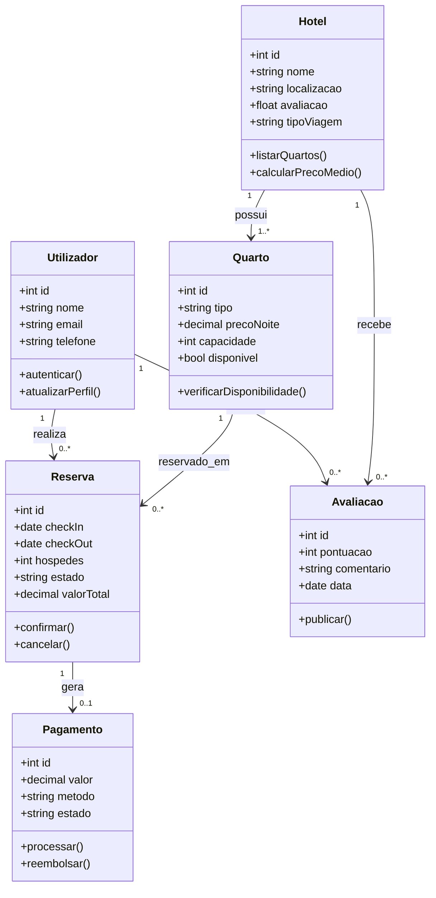
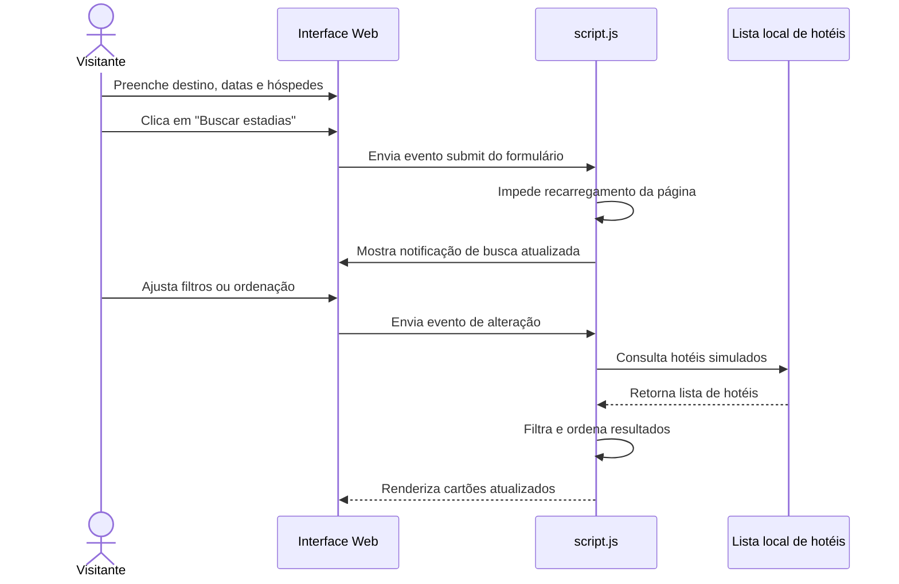
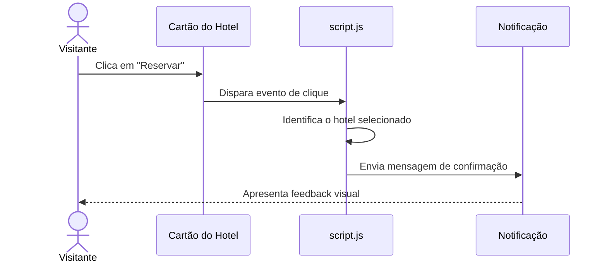
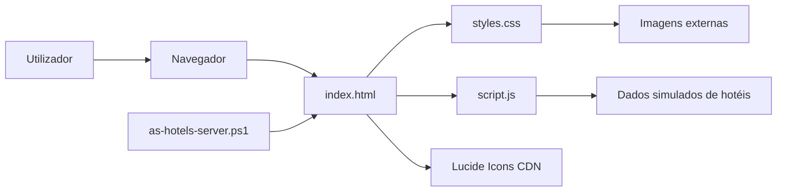
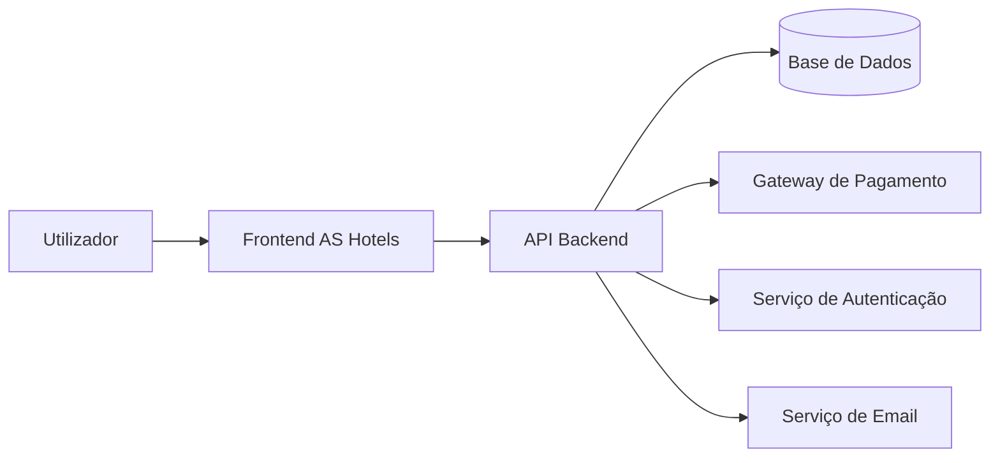

# Relatório Técnico de Análise de Sistemas - AS Hotels

## Introdução

O projeto **AS Hotels** consiste no desenvolvimento de uma aplicação web front-end para reservas de hotel. A solução foi criada com o objetivo de apresentar uma experiência profissional, simples e intuitiva para utilizadores que desejam pesquisar estadias, comparar hotéis e iniciar uma reserva.

A aplicação funciona como um protótipo funcional de uma plataforma de reservas, recorrendo a tecnologias web estáticas: HTML, CSS e JavaScript. Embora não exista ainda integração com base de dados, autenticação ou pagamentos reais, o projeto simula os principais fluxos de uma plataforma hoteleira moderna.

Este relatório apresenta a análise de contexto, os requisitos do sistema, os casos de uso, as user stories, os diagramas técnicos em Mermaid, a arquitetura da aplicação e uma reflexão sobre as competências adquiridas durante o desenvolvimento.

## Análise de Contexto

O setor hoteleiro depende cada vez mais de plataformas digitais para disponibilizar quartos, apresentar ofertas e facilitar o contacto entre hotéis e clientes. Um site de reservas deve permitir que o utilizador encontre rapidamente uma estadia adequada, compare opções e tome uma decisão com confiança.

O **AS Hotels** foi pensado para responder a esse contexto através de uma interface clara, visualmente apelativa e orientada à ação principal: procurar uma estadia. A página inicial apresenta imediatamente o formulário de pesquisa, seguido de indicadores de confiança, filtros, cartões de hotéis e áreas informativas.

### Problema identificado

Muitos sites de reservas tornam a experiência complexa através de excesso de informação, navegação confusa ou pouca clareza nos preços e características dos hotéis. O projeto procura resolver esse problema através de uma interface focada, organizada e responsiva.

### Público-alvo

- Utilizadores que procuram reservar hotéis para lazer.
- Utilizadores que viajam em trabalho.
- Clientes que valorizam rapidez, clareza e comparação visual.
- Pequenas marcas hoteleiras que pretendem apresentar uma experiência digital moderna.

### Stakeholders

- Cliente final que pesquisa e reserva estadias.
- Equipa de gestão da marca AS Hotels.
- Equipa de desenvolvimento e manutenção.
- Potenciais parceiros hoteleiros.

### Sistemas externos considerados

No protótipo atual, os dados são locais e simulados. Numa versão futura, a aplicação poderia integrar:

- API de disponibilidade de quartos.
- Sistema de autenticação.
- Gateway de pagamento.
- Base de dados de hotéis, reservas e utilizadores.
- Serviços externos de mapas, avaliações e notificações.

## Requisitos Funcionais e Não Funcionais

### Requisitos Funcionais

| ID | Requisito | Descrição |
| --- | --- | --- |
| RF01 | Pesquisar estadias | O utilizador deve poder pesquisar hotéis por destino, datas de check-in/check-out e número de hóspedes. |
| RF02 | Listar hotéis recomendados | O sistema deve apresentar uma lista de hotéis disponíveis com nome, localização, avaliação, descrição, comodidades e preço. |
| RF03 | Filtrar por preço | O utilizador deve poder limitar os resultados por preço máximo por noite. |
| RF04 | Filtrar por tipo de viagem | O utilizador deve poder filtrar hotéis por todos, trabalho ou lazer. |
| RF05 | Ordenar resultados | O utilizador deve poder ordenar os hotéis por recomendados, menor preço ou melhor avaliação. |
| RF06 | Ver detalhes resumidos do hotel | O sistema deve mostrar informações essenciais em cartões de comparação. |
| RF07 | Selecionar hotel para reserva | O utilizador deve poder clicar em "Reservar" e receber feedback visual da seleção. |
| RF08 | Apresentar ofertas | O sistema deve exibir uma secção de oferta especial com chamada para ação. |
| RF09 | Apresentar benefícios do serviço | O sistema deve mostrar diferenciais como atendimento, segurança e benefícios exclusivos. |
| RF10 | Executar localmente | O projeto deve poder ser executado diretamente no navegador ou via localhost. |

### Requisitos Não Funcionais

| ID | Requisito | Descrição |
| --- | --- | --- |
| RNF01 | Usabilidade | A interface deve ser simples, clara e orientada à reserva. |
| RNF02 | Responsividade | O layout deve adaptar-se a desktop, tablet e dispositivos móveis. |
| RNF03 | Performance | O carregamento deve ser rápido, com estrutura estática e JavaScript leve. |
| RNF04 | Acessibilidade | A aplicação deve usar HTML semântico, labels em formulários e contraste visual adequado. |
| RNF05 | Manutenibilidade | O código deve estar separado por responsabilidade: estrutura, estilos e comportamento. |
| RNF06 | Compatibilidade | O site deve funcionar em navegadores modernos. |
| RNF07 | Segurança | O protótipo não deve processar dados sensíveis nem pagamentos reais. |
| RNF08 | Escalabilidade futura | A estrutura deve permitir evolução para backend, base de dados e reservas reais. |
| RNF09 | Identidade visual | A aplicação deve manter uma paleta azul e branca associada à marca AS Hotels. |

## Casos de Uso

### UC01 - Pesquisar estadia

**Ator principal:** Visitante  
**Pré-condição:** O utilizador acede ao site AS Hotels.  
**Pós-condição:** A lista de hotéis é apresentada ou atualizada.

**Fluxo principal:**

1. O utilizador introduz ou confirma o destino.
2. O utilizador escolhe as datas de check-in e check-out.
3. O utilizador seleciona o número de hóspedes.
4. O utilizador clica em "Buscar estadias".
5. O sistema apresenta feedback visual informando que a busca foi atualizada.

**Fluxos alternativos:**

- Se o destino estiver vazio, o sistema utiliza uma mensagem genérica para o destino escolhido.
- Se as datas não forem alteradas, o sistema mantém as datas sugeridas automaticamente.

### UC02 - Filtrar hotéis

**Ator principal:** Visitante  
**Pré-condição:** A lista de hotéis está disponível.  
**Pós-condição:** A lista apresenta apenas hotéis compatíveis com os filtros selecionados.

**Fluxo principal:**

1. O utilizador ajusta o preço máximo por noite.
2. O utilizador seleciona o tipo de viagem.
3. O sistema recalcula os hotéis visíveis.
4. O sistema atualiza a lista no ecrã.

### UC03 - Ordenar resultados

**Ator principal:** Visitante  
**Pré-condição:** Existem hotéis disponíveis na lista.  
**Pós-condição:** Os hotéis são reorganizados conforme o critério escolhido.

**Fluxo principal:**

1. O utilizador abre o seletor de ordenação.
2. O utilizador escolhe recomendados, menor preço ou melhor avaliação.
3. O sistema ordena os hotéis.
4. O sistema renderiza novamente a lista.

### UC04 - Selecionar hotel para reserva

**Ator principal:** Visitante  
**Pré-condição:** Existe pelo menos um hotel apresentado.  
**Pós-condição:** O sistema confirma visualmente o hotel selecionado.

**Fluxo principal:**

1. O utilizador analisa um cartão de hotel.
2. O utilizador clica no botão "Reservar".
3. O sistema apresenta uma notificação com o nome do hotel selecionado.

## User Stories

| ID | User Story | Critério de aceitação |
| --- | --- | --- |
| US01 | Como visitante, quero pesquisar hotéis por destino e datas, para encontrar estadias adequadas à minha viagem. | O formulário deve permitir preencher destino, datas e hóspedes. |
| US02 | Como visitante, quero ver hotéis recomendados, para comparar opções rapidamente. | Cada hotel deve apresentar nome, preço, avaliação, localização e comodidades. |
| US03 | Como visitante, quero filtrar hotéis por preço, para encontrar opções dentro do meu orçamento. | O slider de preço deve atualizar a lista de hotéis. |
| US04 | Como visitante, quero filtrar por tipo de viagem, para ver hotéis mais adequados ao meu objetivo. | Os botões de tipo de viagem devem alterar os resultados visíveis. |
| US05 | Como visitante, quero ordenar os resultados, para comparar por preço ou avaliação. | O seletor de ordenação deve reorganizar os cartões. |
| US06 | Como visitante, quero receber feedback ao selecionar um hotel, para saber que a minha ação foi registada. | O sistema deve apresentar uma notificação ao clicar em "Reservar". |
| US07 | Como utilizador móvel, quero usar o site no telemóvel, para pesquisar hotéis sem dificuldades. | O layout deve adaptar-se a ecrãs pequenos sem sobreposição de elementos. |
| US08 | Como gestor da marca, quero apresentar benefícios e ofertas, para aumentar a confiança e a conversão. | A página deve incluir secções de oferta e experiências. |

## Diagramas de Classe

O diagrama seguinte representa uma proposta de modelo de domínio para uma evolução futura da aplicação. No protótipo atual, estes dados estão simulados no ficheiro JavaScript, mas as entidades poderiam ser convertidas em classes ou tabelas numa versão com backend.

## Diagramas de Sequência

### Sequência 1 - Pesquisa e filtragem de hotéis

### Sequência 2 - Seleção de hotel para reserva

## Descrição da Arquitetura da Aplicação

A aplicação segue uma arquitetura front-end estática, organizada em três camadas principais:

### Camada de apresentação

Representada pelo ficheiro `index.html`, define a estrutura da página, incluindo cabeçalho, hero, formulário de pesquisa, filtros, lista de hotéis, oferta especial, benefícios e rodapé.

### Camada de estilo

Representada pelo ficheiro `styles.css`, controla a identidade visual, layout responsivo, espaçamentos, cores, botões, cartões, filtros e adaptação a diferentes tamanhos de ecrã.

### Camada de comportamento

Representada pelo ficheiro `script.js`, contém a lógica de interação:

- Dados simulados dos hotéis.
- Renderização dinâmica dos cartões.
- Filtro por preço.
- Filtro por tipo de viagem.
- Ordenação dos resultados.
- Datas padrão.
- Notificações de feedback.

### Servidor local

O ficheiro `as-hotels-server.ps1` permite servir os ficheiros localmente através de `localhost`, sem necessidade de instalar Python ou Node.js. Esta abordagem facilita a demonstração do projeto em ambiente Windows.

### Arquitetura atual

### Possível arquitetura futura

## Reflexão sobre Competências Adquiridas

Durante o desenvolvimento do projeto AS Hotels, foram trabalhadas várias competências técnicas e analíticas importantes para a área de Análise de Sistemas.

Em primeiro lugar, foi reforçada a capacidade de transformar uma ideia inicial num conjunto estruturado de funcionalidades. A partir do objetivo de criar um site de reservas de hotel, foi necessário identificar o público-alvo, os fluxos principais, os requisitos funcionais e os requisitos não funcionais.

Também foram desenvolvidas competências de modelação, especialmente através da criação de casos de uso, user stories e diagramas Mermaid. Estes elementos ajudam a documentar o funcionamento do sistema e facilitam a comunicação entre utilizadores, analistas e programadores.

No lado técnico, o projeto permitiu consolidar conhecimentos de HTML, CSS e JavaScript, bem como boas práticas de separação de responsabilidades. A estrutura do projeto mostra uma divisão clara entre conteúdo, apresentação e comportamento.

Por fim, a construção de uma interface responsiva e visualmente cuidada contribuiu para uma melhor compreensão da importância da experiência do utilizador. Um sistema não deve apenas funcionar; deve ser fácil de compreender, rápido de usar e coerente com as necessidades do seu público.

## Conclusão

O projeto **AS Hotels** demonstra a criação de um protótipo funcional para uma plataforma de reservas de hotel. Apesar de ser uma aplicação front-end estática, o sistema já apresenta funcionalidades essenciais como pesquisa, filtros, ordenação, cartões de hotéis e feedback visual.

A análise realizada mostra que o projeto possui uma base sólida para evolução. Numa fase futura, poderá ser integrado com backend, base de dados, autenticação, pagamentos e gestão real de reservas.

Este relatório documenta o sistema de forma técnica e organizada, permitindo compreender o contexto, os requisitos, os principais fluxos de utilização, a arquitetura atual e as possibilidades de crescimento da aplicação.
